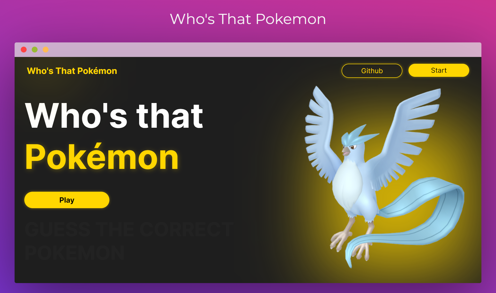
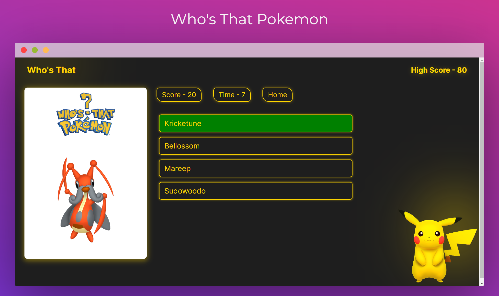

# Who's That Pokemon [](https://app.netlify.com/sites/super-travesseiro-d42d4a/deploys)

An application that puts your Pokémon knowledge to the test!

## Live Demo
You can explore the **live demo** of this Todo App by visiting [here](https://super-travesseiro-d42d4a.netlify.app/)

## Preview




## Project Description

Welcome to "Who's That Pokemon?" – an engaging React application that puts your Pokémon knowledge to the test! This interactive game challenges players to identify Pokémon from their shadows, adding an exciting twist to the classic guessing game. The application leverages the PokeAPI to fetch real-time data, ensuring an up-to-date and diverse selection of Pokémon for an immersive gaming experience.

## What I Learnt/Used

-  : The core library for building the user interface and managing the application's state.
-  : Facilitates seamless navigation within the application, ensuring a smooth user experience.
-  : A RESTful API providing extensive Pokémon data, enhancing the game's content and realism.

## Requirements

Before getting started with this project, you should have:

- Basic knowledge of React.js.
- Basic knowledge of HTML and CSS.

## Usage

1. Clone this repository to your local machine:

```bash
  git clone https://github.com/aditya-armal/Guess-Pokemon.git
```
Navigate to the project directory:

```bash
cd Guess-Pokemon
```
Install the project dependencies:

```bash
npm install
```
Start the development server:

```bash
npm start
```
Open your web browser and visit http://localhost:3000 to access the Application.
